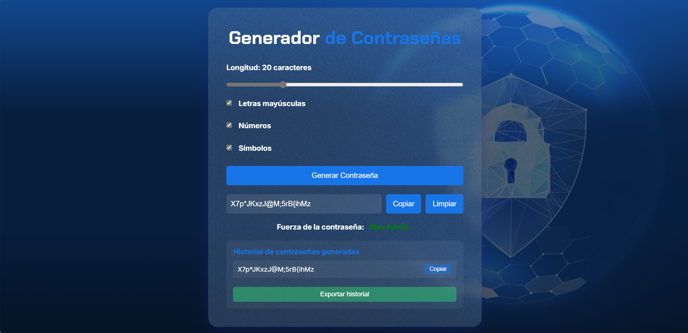

# 🔐 Generador de Contraseñas Seguras

Un generador de contraseñas moderno y seguro construido con HTML, CSS y JavaScript puro. Genera contraseñas aleatorias con diferentes niveles de complejidad y mantiene un historial de las últimas generadas.

## ✨ Características

- 🎯 Genera contraseñas aleatorias de 8 a 60 caracteres
- 🔄 Personalización de contraseñas con:
  - Letras minúsculas
  - Letras mayúsculas
  - Números
  - Símbolos especiales
- 📊 Indicador de fortaleza de contraseña
- 📋 Función de copiado al portapapeles con un clic
- 🗑️ Botón de limpieza rápida
- 📜 Historial de últimas 5 contraseñas generadas
- 💾 Exportación del historial a archivo de texto
- 📱 Diseño responsivo para todos los dispositivos

## 🚀 Uso

1. Ajusta la longitud deseada usando el control deslizante
2. Selecciona los tipos de caracteres que deseas incluir
3. Haz clic en "Generar Contraseña"
4. Copia la contraseña con el botón "Copiar"
5. Visualiza el historial de contraseñas anteriores
6. Exporta el historial si lo necesitas

## 💪 Niveles de Fortaleza

- 🔴 **Débil**: Solo un tipo de caracteres
- 🟠 **Moderada**: Dos tipos de caracteres
- 🟡 **Fuerte**: Tres tipos de caracteres
- 🟢 **Muy fuerte**: Todos los tipos de caracteres

## 🛠️ Tecnologías Utilizadas

- HTML5
- CSS3 (con variables y flexbox)
- JavaScript vanilla
- Google Fonts (Chakra Petch, Inter)

## 📝 Licencia

Este proyecto está bajo la Licencia MIT - mira el archivo [LICENSE.md](LICENSE.md) para detalles

## 👨‍💻 Autor

Brandon Almachi - [GitHub](https://github.com/tuusuario)

---

⌨️ con ❤️ por Meruzz
